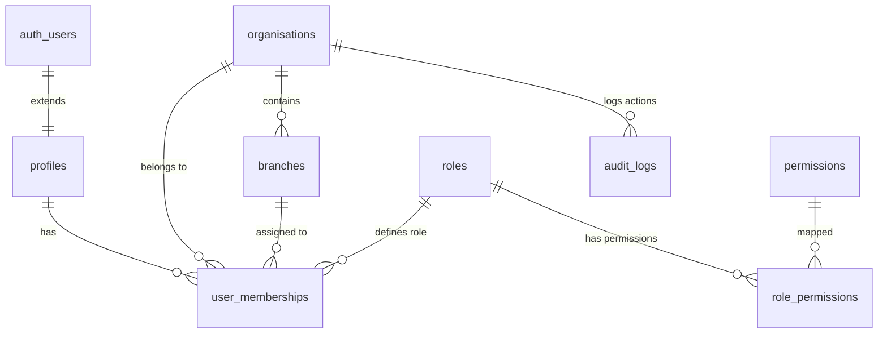

# 🗄 PulseIQ — Database Schema & RLS Policy Specification

## Overview
PulseIQ uses **Supabase PostgreSQL** as its single source of truth. Multi-tenancy is enforced at the database layer via **Row Level Security (RLS)**, ensuring strict data isolation across wellness organisations and branch locations.

---

## 📐 ERD & Table Schemas

### 1. `roles`
| Column | Type | Constraints | Description |
| :--- | :--- | :--- | :--- |
| `id` | `TEXT` | `PRIMARY KEY` | Role key (`platform_admin`, `organisation_owner`, `centre_manager`, `coach`, `receptionist`, `customer`) |
| `name` | `TEXT` | `NOT NULL` | Human-readable role title |
| `description` | `TEXT` | | Detailed role capabilities |
| `is_system` | `BOOLEAN` | `DEFAULT false` | System immutable role flag |

### 2. `permissions`
| Column | Type | Constraints | Description |
| :--- | :--- | :--- | :--- |
| `id` | `TEXT` | `PRIMARY KEY` | Permission key (e.g. `org:manage`, `branch:manage`, `customers:read`, `ai_diet:generate`) |
| `name` | `TEXT` | `NOT NULL` | Display name |
| `category` | `TEXT` | `NOT NULL` | Functional domain category |

### 3. `profiles`
| Column | Type | Constraints | Description |
| :--- | :--- | :--- | :--- |
| `id` | `UUID` | `PRIMARY KEY, REFERENCES auth.users(id)` | User unique identifier |
| `email` | `TEXT` | `NOT NULL` | Auth email address |
| `full_name` | `TEXT` | | Full display name |
| `avatar_url` | `TEXT` | | Avatar profile picture URL |
| `phone` | `TEXT` | | Contact telephone number |
| `is_platform_admin` | `BOOLEAN` | `DEFAULT false` | Global super-admin override flag |

### 4. `organisations`
| Column | Type | Constraints | Description |
| :--- | :--- | :--- | :--- |
| `id` | `UUID` | `PRIMARY KEY DEFAULT gen_random_uuid()` | Organisation unique ID |
| `name` | `TEXT` | `NOT NULL` | Wellness organisation title |
| `slug` | `TEXT` | `UNIQUE NOT NULL` | URL-safe slug |
| `logo_url` | `TEXT` | | Brand logo asset URL |
| `status` | `TEXT` | `DEFAULT 'active'` | Status (`active`, `suspended`, `pending`) |

### 5. `branches`
| Column | Type | Constraints | Description |
| :--- | :--- | :--- | :--- |
| `id` | `UUID` | `PRIMARY KEY DEFAULT gen_random_uuid()` | Physical branch location ID |
| `organisation_id` | `UUID` | `REFERENCES organisations(id)` | Parent organisation ID |
| `name` | `TEXT` | `NOT NULL` | Branch location name |
| `code` | `TEXT` | `NOT NULL` | Unique branch code per org |
| `pin_hash` | `TEXT` | | Optional center PIN authorization hash |

### 6. `user_memberships`
| Column | Type | Constraints | Description |
| :--- | :--- | :--- | :--- |
| `id` | `UUID` | `PRIMARY KEY DEFAULT gen_random_uuid()` | Membership association ID |
| `user_id` | `UUID` | `REFERENCES profiles(id)` | Associated user profile ID |
| `organisation_id` | `UUID` | `REFERENCES organisations(id)` | Associated organisation ID |
| `branch_id` | `UUID` | `REFERENCES branches(id)` | Optional branch ID (NULL = org-wide) |
| `role_id` | `TEXT` | `REFERENCES roles(id)` | Assigned RBAC role |
| `status` | `TEXT` | `DEFAULT 'active'` | Status (`active`, `invited`, `disabled`) |

---

## 🔒 Row Level Security (RLS) Policy Summary

All database tables have **RLS enabled** (`ALTER TABLE <table> ENABLE ROW LEVEL SECURITY;`):

- **Profiles RLS**:
  - `Users can view their own profile`: `auth.uid() = id`
  - `Members of same organisation can view co-member profiles`: `EXISTS (user_memberships match org_id)`
- **Organisations RLS**:
  - `Users can view organisations they belong to`: `EXISTS (user_memberships match org_id AND user_id = auth.uid())`
- **Branches RLS**:
  - `Users can view branches in their organisation`: `EXISTS (user_memberships match org_id AND (branch_id IS NULL OR branch_id = branch.id))`
- **User Memberships RLS**:
  - `Users can view their own memberships`: `user_id = auth.uid()`
  - `Organisation owners and managers can manage memberships`: `EXISTS (role_id IN ('organisation_owner', 'centre_manager', 'platform_admin'))`
