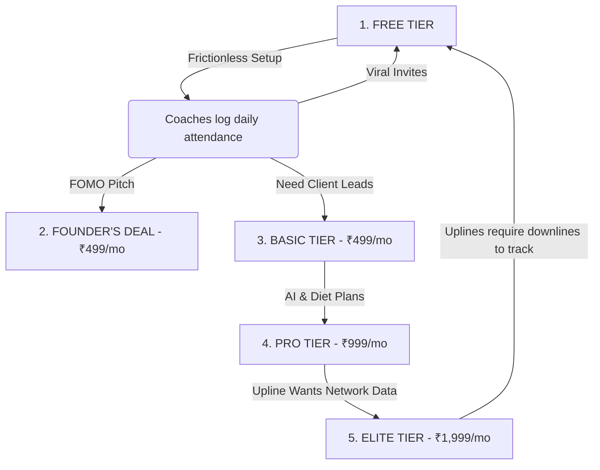

# PulseZen — Subscription Plans & Business Strategy

Last updated: June 27, 2026

**Strategic Philosophy:** Lock in benefits and prices forever for early adopters (Founder's Deal) to build massive trust. The Free tier acts as a viral acquisition engine, while premium tiers offer automation, online presence, and advanced AI tools.

---

## 1. Plan Pricing & Gating Structure

### FREE — ₹0
*Goal: Rapid user acquisition and system onboarding.*
* **Customer Cap:** Up to **20 active customers**
* **Core Benefits:**
  - Daily Attendance Tracking
  - Viral Invite Link (downline referral mechanism)
  - Secure Email OTP Login (no passwords)
* *Gating:* No public website, no finance dashboard, no body composition tracking, no AI features.

### STARTER — ₹99/month
*Goal: Simple Google presence for centers not needing internal management tools.*
* **Customer Cap:** **0 customers** (no CRM features)
* **Core Benefits:**
  - **Your Own Website:** `[centername].pulsezen.in` to rank on Google locally.
  - **WhatsApp Booking Button:** Direct lead routing from the website to the coach's WhatsApp.
* *Gating:* No customer/coach management, no attendance, no finance dashboard, no body composition logs.

### BASIC — ₹499/month
*Goal: Local search visibility (SEO) and professional center operations.*
* **Customer Cap:** Up to **200 active customers**
* **Core Benefits:**
  - **Your Own Website:** `[centername].pulsezen.in` to rank on Google locally.
  - **WhatsApp Booking Button:** Direct lead routing from the website to the coach's WhatsApp.
  - **Body Composition Tracking:** Weight, fat%, muscle%, visceral fat tracking with health scores.
  - **Finance Dashboard:** Ledger tracking (income, expenses, net profit, pending payments).
  - **Automation Tools:** Pack expiry alerts, one-click WhatsApp renewal nudges.
  - **Referral Rewards:** Automatic coupon system when customers refer friends.
  - **Data Portability:** CSV exports for customers, finance, and body composition logs.

### PRO — ₹999/month
*Goal: Serious center owners looking for unlimited growth and meal planning.*
* **Customer Cap:** **Unlimited customers**
* **Core Benefits:**
  - **All Basic Features**
  - **AI Personalized Diet Plans:** Auto-generated 7-day meal plans based on customer body composition.
  - **AI Health Insights:** Trend alerts and personalized coaching tips for clients.
  - **Area Exclusivity:** Locality lock to block direct competitors in the same neighborhood.

### ELITE — ₹1,999/month
*Goal: AI-powered center automation and multi-center organization management.*
* **Customer Cap:** **Unlimited customers**
* **Core Benefits:**
  - **All Pro Features**
  - **AI Churn Risk Alerts:** Auto-flagging clients likely to drop out.
  - **Finance AI Analyst:** Monthly automated profitability and resource allocation recommendations.
  - **Org Analytics Dashboard:** Upline tracking of downline centers' revenue, attendance, and metrics.
  - **Priority Support:** Direct developer WhatsApp hotline.

### FOUNDER'S DEAL — ₹499/month (Lifetime Price Lock)
*Goal: Early adopter trust builder and initial cash flow generator.*
* **Assigned:** Manually by supervisor via **Plan Management**.
* **Benefits:** **All PRO and ELITE features** at the **Basic price point (₹499/mo)**, locked forever.

---

## 2. Plan Comparison

| Feature | Free | Starter | Basic | Pro | Elite | Founder's Deal |
|---|---|---|---|---|---|---|
| **Price** | ₹0 | ₹99/mo | ₹499/mo | ₹999/mo | ₹1,999/mo | ₹499/mo (locked) |
| **Customers** | 20 | 0 | 200 | Unlimited | Unlimited | Unlimited |
| **Attendance** | ✅ | ❌ | ✅ | ✅ | ✅ | ✅ |
| **Invite Link** | ✅ | ❌ | ✅ | ✅ | ✅ | ✅ |
| **Website (pulsezen.in)** | ❌ | ✅ | ✅ | ✅ | ✅ | ✅ |
| **Body Composition** | ❌ | ❌ | ✅ | ✅ | ✅ | ✅ |
| **Finance Dashboard** | ❌ | ❌ | ✅ | ✅ | ✅ | ✅ |
| **Pack Expiry & Nudges** | ❌ | ❌ | ✅ | ✅ | ✅ | ✅ |
| **Coupon & Referral** | ❌ | ❌ | ✅ | ✅ | ✅ | ✅ |
| **CSV Exports** | ❌ | ❌ | ✅ | ✅ | ✅ | ✅ |
| **AI Diet & Health Plans**| ❌ | ❌ | ❌ | ✅ | ✅ | ✅ |
| **AI Churn & Finance** | ❌ | ❌ | ❌ | ❌ | ✅ | ✅ |
| **Org Analytics** | ❌ | ❌ | ❌ | ❌ | ✅ | ✅ |
| **Priority Support** | ❌ | ❌ | ❌ | ❌ | ✅ | ✅ |

---

## 3. Playbook for High-Volume Client Acquisition

