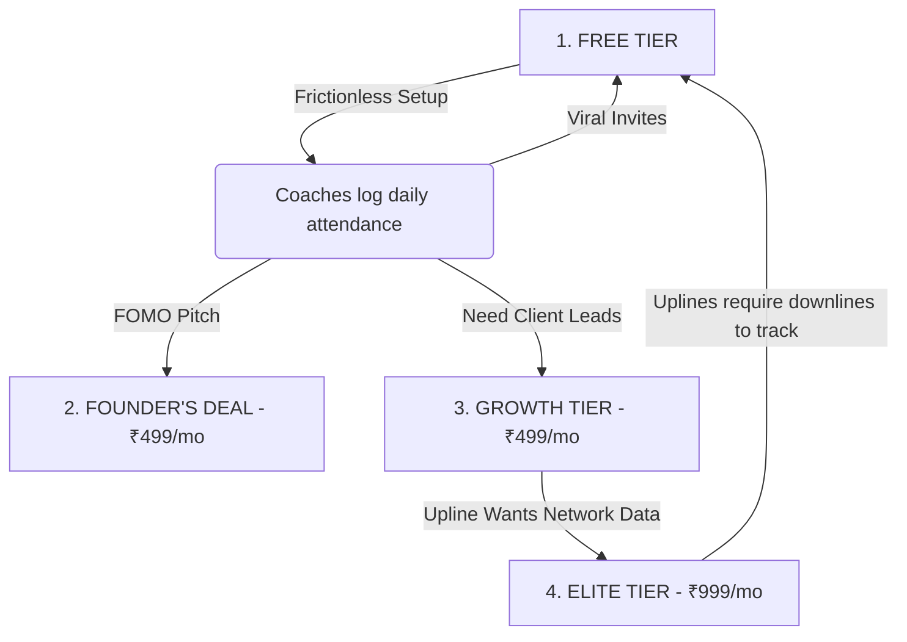

# PulseZen — Subscription Plans & Business Strategy

Last updated: June 18, 2026

**Strategic Philosophy:** Lock in benefits and prices forever for early adopters (Founder's Deal) to build massive trust. The Free tier acts as a viral acquisition engine, while premium tiers offer automation, online presence, and advanced AI tools.

---

## 1. Plan Pricing & Gating Structure

### FREE — ₹0
*Goal: Rapid user acquisition and system onboarding.*
* **Customer Cap:** Up to **20 active customers**
* **Core Benefits:**
  - Daily Attendance Tracking
  - Viral Invite Link (downline referral mechanism)
  - Secure Email OTP Login (no passwords)
* *Gating:* No public website, no finance dashboard, no body composition tracking, no AI features.

### GROWTH — ₹499/month
*Goal: Local search visibility (SEO) and professional center operations.*
* **Customer Cap:** Up to **200 active customers**
* **Core Benefits:**
  - **Your Own Website:** `[centername].pulsezen.in` to rank on Google locally.
  - **WhatsApp Booking Button:** Direct lead routing from the website to the coach's WhatsApp.
  - **Body Composition Tracking:** Weight, fat%, muscle%, visceral fat tracking with health scores.
  - **Finance Dashboard:** Ledger tracking (income, expenses, net profit, pending payments).
  - **Automation Tools:** Pack expiry alerts, one-click WhatsApp renewal nudges.
  - **Referral Rewards:** Automatic coupon system when customers refer friends.
  - **Data Portability:** CSV exports for customers, finance, and body composition logs.

### ELITE — ₹999/month
*Goal: AI-powered center automation and multi-center organization management.*
* **Customer Cap:** **Unlimited customers**
* **Core Benefits:**
  - **AI Personalized Diet Plans:** Auto-generated 7-day meal plans based on customer body composition.
  - **AI Health Insights:** Trend alerts and personalized coaching tips for clients.
  - **AI Churn Risk Alerts:** Auto-flagging clients likely to drop out.
  - **Finance AI Analyst:** Monthly automated profitability and resource allocation recommendations.
  - **Org Analytics Dashboard:** Upline tracking of downline centers' revenue, attendance, and metrics.
  - **Priority Support:** Direct developer WhatsApp hotline.

### FOUNDER'S DEAL — ₹499/month (Lifetime Price Lock)
*Goal: Early adopter trust builder and initial cash flow generator.*
* **Assigned:** Manually by supervisor via **Plan Management**.
* **Benefits:** **All ELITE features** at the **Growth price point (₹499/mo)**, locked forever.

---

## 2. Plan Comparison

| Feature | Free | Growth | Elite | Founder's Deal |
|---|---|---|---|---|
| **Price** | ₹0 | ₹499/mo | ₹999/mo | ₹499/mo (locked) |
| **Customers** | 20 | 200 | Unlimited | Unlimited |
| **Attendance** | ✅ | ✅ | ✅ | ✅ |
| **Invite Link** | ✅ | ✅ | ✅ | ✅ |
| **Website (pulsezen.in)** | ❌ | ✅ | ✅ | ✅ |
| **Body Composition** | ❌ | ✅ | ✅ | ✅ |
| **Finance Dashboard** | ❌ | ✅ | ✅ | ✅ |
| **Pack Expiry & Nudges** | ❌ | ✅ | ✅ | ✅ |
| **Coupon & Referral** | ❌ | ✅ | ✅ | ✅ |
| **CSV Exports** | ❌ | ✅ | ✅ | ✅ |
| **AI Diet & Health Plans**| ❌ | ❌ | ✅ | ✅ |
| **AI Churn & Finance** | ❌ | ❌ | ✅ | ✅ |
| **Org Analytics** | ❌ | ❌ | ✅ | ✅ |
| **Priority Support** | ❌ | ❌ | ✅ | ✅ |

---

## 3. Playbook for High-Volume Client Acquisition

### Growth Loop 1: The Viral Invite Loop (Raw Acquisition)
Coaches operate in highly linked social structures. By placing the **Invite Link** in the Free tier, we encourage coaches to onboard their downline peers.
1. Coach A registers.
2. Coach A invites Coach B using their network link.
3. Coach B joins the Free tier instantly.
4. **Action Item:** Make the referral bonus attractive (e.g., "Refer 3 centers, get 1 month of Growth free").

### Growth Loop 2: The SEO Website Hook (Conversion to Growth)
Coaches care about getting new customers. 
1. Pitch the Growth tier not as an administrative utility, but as a **Marketing and Lead Generation Engine**.
2. **Action Item:** Provide template websites (`[name].pulsezen.in`) with automated SEO tags. When they see their center on Google Maps routing directly to their WhatsApp, the ₹499/mo feels minor compared to gaining 1 new customer.

### Growth Loop 3: Upline Leverage (Enterprise Conversion to Elite)
The key to scale is targeting the organization leaders.
1. Large organization supervisors (uplines) have 10–50 downline wellness centers. They want visibility into their entire network's performance.
2. **Action Item:** Offer the **Org Analytics Dashboard** only under **Elite**. Once an organization leader upgrades to Elite, they will mandate all their downline centers to use PulseZen (even if on the Free tier) so their leader board populates. The upline becomes your sales team.

---

## 4. Upsell & Sales Scripts

### The Free Onboarding Script
> *"Hey [Coach Name], I set up a free tool for you to manage your attendance. No card needed. It generates a signup link you can share with other coaches in your circle. I'll text it to you now."*

### The SEO / Website Pitch (Growth Upgrade)
> *"I noticed you don't have a Google website for your center. For ₹499/mo, PulseZen gives you your own domain name (`yourcenter.pulsezen.in`) with a WhatsApp contact button. It takes 1 new customer to make that back. I can activate it right now."*

### The Founder's Deal Pitch (Scarcity Trigger)
> *"Since you're one of our first active centers, I can lock you in on the Founder's Deal. You get the full Elite plan—unlimited clients, AI diet plans, and org dashboards—for the price of the Growth plan (₹499/mo) locked in forever. I only have 5 slots left for this. Let's get you upgraded."*
