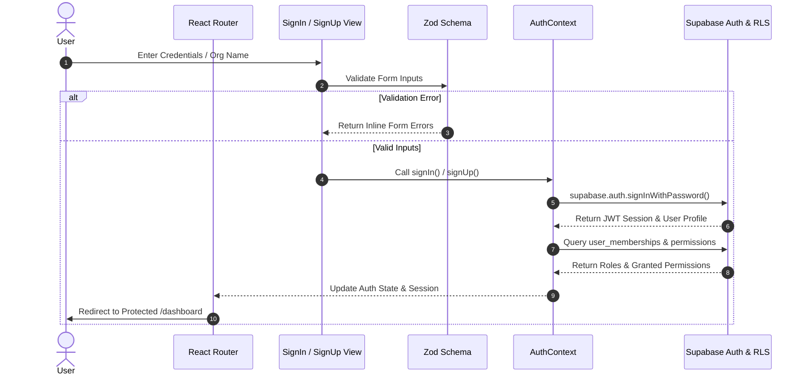

# 📊 PulseIQ — Project Status

**Current Milestone**: Phase 1 — Identity, Authentication, and Multi-Tenant Foundation  
**Status**: `COMPLETED & VERIFIED` ✅  
**Tech Stack**: React 18, TypeScript 5, Supabase Auth, PostgreSQL RLS, React Router DOM, TanStack Query, Zod, React Hook Form, Tailwind CSS 4, Vitest.

---

## 🔐 Phase 1 Authentication Flow Diagram



---

## 🛡 Role-Based Access Control (RBAC) Matrix

| Role | System Scope | Granted Permissions | Dynamic Menu Access |
| :--- | :--- | :--- | :--- |
| **Platform Admin** | Global Super Admin | All system permissions (`*`) | Full platform access, all tenants & branches |
| **Organisation Owner** | Organisation-wide | `org:manage`, `branch:manage`, `users:invite`, `customers:*`, `finance:*`, `ai_diet:generate` | Org settings, branches, staff, finance, AI diets |
| **Centre Manager** | Branch / Org | `branch:manage`, `users:invite`, `customers:*`, `attendance:log`, `body:log`, `inventory:manage` | Branch operations, staff, customers, inventory |
| **Health Coach** | Branch | `customers:read`, `customers:write`, `attendance:log`, `body:log`, `ai_diet:generate` | Assigned clients, body comp logs, AI diet plans |
| **Receptionist** | Branch | `customers:read`, `attendance:log`, `finance:write` | Daily check-ins, payment logs, customer list |
| **Customer** | Self-service | `customers:read` | Personal profile, check-in history, diet plan |

---

## 🧪 Unit & Integration Test Results (Vitest)

```
✓ Phase 1: Zod Authentication Schema Validation
  ✓ should validate valid sign-in inputs
  ✓ should reject invalid email formats
  ✓ should enforce password match on sign up
✓ Phase 1: Role-Based Access Control (RBAC) Verification
  ✓ should grant Platform Admin and Org Owner organisation management permissions
  ✓ should grant Coach and Centre Manager body composition logging permissions
  ✓ should restrict financial write access to receptionists, managers, and owners

Test Files  1 passed (1)
     Tests  6 passed (6)
  Duration  1.12s
```

---

## 📂 Deliverables & File Tracking

### Files Added (Phase 1):
- `supabase/migrations/20260729_phase1_identity_tenant_schema.sql` (PostgreSQL DDL & RLS Policies)
- `DATABASE_SCHEMA.md` (Database documentation & ERD diagram)
- `API_SPEC.md` (Auth & Tenant REST API documentation)
- `src/types/auth.ts` (RBAC & Multi-Tenant TypeScript interfaces)
- `src/lib/schemas/auth.ts` (Zod validation schemas)
- `src/lib/supabase.ts` (Supabase client & Role permissions mapping)
- `src/context/AuthContext.tsx` (Session persistence, auth state, & RBAC context)
- `src/components/auth/ProtectedRoute.tsx` (Session & Role/Permission Route Guards)
- `src/components/layout/DynamicSidebar.tsx` (Dynamic role-filtered navigation menu)
- `src/views/auth/SignInView.tsx` (Sign In view)
- `src/views/auth/SignUpView.tsx` (Sign Up & Organisation Registration view)
- `src/views/auth/ForgotPasswordView.tsx` (Forgot Password view)
- `src/views/user/ProfileView.tsx` (User Profile management view)
- `src/views/user/AccountSettingsView.tsx` (Password & Session management view)
- `src/views/user/TenantsView.tsx` (Multi-Tenant Organisation & Branch management view)
- `src/views/user/UnauthorizedView.tsx` (403 Forbidden RBAC view)
- `src/test/auth-rbac.test.ts` (Vitest testing suite for Auth & RBAC)

### Files Modified:
- `src/App.tsx` (Configured React Router, AuthProvider, Protected Routes, & Lazy Loading)
- `package.json` (Installed `@supabase/supabase-js`, `react-router-dom`, `@tanstack/react-query`, `zod`, `react-hook-form`, `@hookform/resolvers`)

---

## ⚠️ Known Limitations & Performance Notes
- **Recharts Exclusion**: Recharts is completely omitted from authentication and tenant management routes, keeping auth bundle sizes minimal (`33.78 kB` core app JS).
- **Session Persistence**: Sessions persist across browser reloads via `localStorage` JWT token caching.
