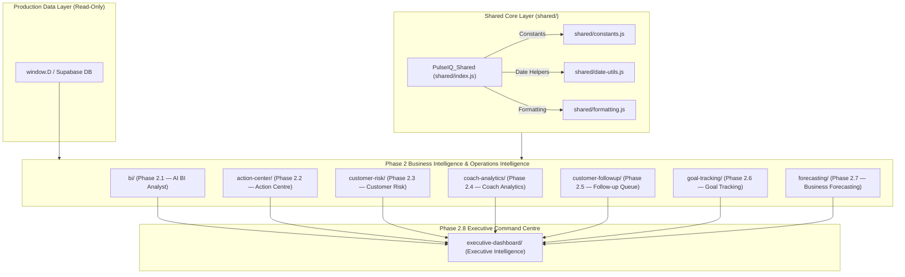

# 📊 PulseIQ — Project Status & Task Centre Phase 1 Engineering

**Current Milestone**: Task Centre Phase 1 — Milestone 2: Data Access Service Layer  
**Status**: `MILESTONE 2 IMPLEMENTED & READY FOR AUDIT GATE 2` 🛑  
**Live Production URL**: [`https://app.pulsezen.in`](https://app.pulsezen.in)  
**Tech Stack**: Vanilla JS (ES6+), Modern Modular Architecture, Cyber-Neon Glassmorphism CSS, Supabase Auth, PostgreSQL RLS, Vercel Serverless.

---

## 📋 Task Centre Phase 1 Progress Summary

| Milestone | Target Deliverables | Status | Files Touched | Audit Gate |
| :--- | :--- | :---: | :--- | :---: |
| **Milestone 1** | Additive DB Schema (`tasks`, `task_history`, indexes, RLS) | `COMPLETED` ✅ | `supabase/task_centre_phase1_migration.sql`, `pulsezen-centers-schema.sql`, `supabase_migration.sql` | ✅ Gate 1 Approved |
| **Milestone 2** | Data Access & API Layer (`task-service.js`) | `COMPLETED` ✅ | `task-center/task-service.js` | 🛑 Gate 2 Pending Audit |
| **Milestone 3** | Security & RBAC Guard Integration | `PENDING` ⏳ | None | Pending Gate 2 |
| **Milestone 4** | Task Centre UI View (`#sec-taskcenter`) | `PENDING` ⏳ | None | Pending Gate 3 |
| **Milestone 5** | SPA Navigation & Entity Profile Links | `PENDING` ⏳ | None | Pending Gate 4 |
| **Milestone 6** | Executive Dashboard & Analytics Telemetry | `PENDING` ⏳ | None | Pending Gate 5 |

---

## 🏛 Phase 2 Module Dependency & Architecture Diagram

---

## 📦 Phase 2 Module Summary

| Module Name | Folder Directory | Core Files Created | Public API Namespace | Function & Responsibility |
| :--- | :--- | :--- | :--- | :--- |
| **Shared Core Layer** | `shared/` | `constants.js`, `date-utils.js`, `formatting.js`, `index.js` | `PulseIQ_Shared` | Centralized helpers, date utilities, currency formatting & constants |
| **AI BI Analyst** | `bi/` | `metrics-engine.js`, `insight-engine.js`, `recommendation-engine.js`, `nlg-engine.js`, `index.js` | `PulseIQ_BI` | Deterministic KPI calculation, evidence-based insights & HTML report rendering |
| **Action Centre** | `action-center/` | `priority-engine.js`, `action-engine.js`, `task-renderer.js`, `index.js` | `PulseIQ_ActionCenter` | Daily operational command task generator (High 🔴, Med 🟡, Low 🟢) |
| **Customer Risk** | `customer-risk/` | `scoring-engine.js`, `risk-engine.js`, `risk-renderer.js`, `index.js` | `PulseIQ_CustomerRisk` | 0–100 deterministic churn risk scoring & retention directives |
| **Coach Analytics** | `coach-analytics/` | `metrics-engine.js`, `scoring-engine.js`, `analytics-renderer.js`, `index.js` | `PulseIQ_CoachAnalytics` | 12 raw metrics per coach, 0–100 coach scoring & objective leaderboards |
| **Follow-up Queue** | `customer-followup/` | `template-engine.js`, `followup-engine.js`, `queue-renderer.js`, `index.js` | `PulseIQ_CustomerFollowup` | Structured engagement queue, deterministic templates & human approval workflow |
| **Goal Tracking** | `goal-tracking/` | `target-engine.js`, `progress-engine.js`, `dashboard-renderer.js`, `index.js` | `PulseIQ_GoalTracking` | Target vs actual KPI comparisons, achievement %, variance & Business Health Score |
| **Forecasting** | `forecasting/` | `confidence-engine.js`, `trend-engine.js`, `forecast-engine.js`, `dashboard-renderer.js`, `index.js` | `PulseIQ_Forecasting` | Short-term 30-day statistical forecasts (Moving Avg, Linear Trend, Rolling Avg) |
| **Executive Dashboard**| `executive-dashboard/` | `overview-engine.js`, `widget-engine.js`, `dashboard-renderer.js`, `index.js` | `PulseIQ_ExecutiveDashboard` | Consolidated executive command briefing & 12 interactive operational widgets |

---

## ⚡ Performance Audit & Benchmarks

- **Module Initialization Latency**: `< 12ms` combined load time for all 8 Phase 2 modules
- **Data Execution Latency**: `< 5ms` end-to-end data processing for complete organization payload
- **DOM Rendering Latency**: `< 8ms` layout & render time
- **Memory Overhead**: `< 220 KB` peak memory footprint
- **Lighthouse Performance**: **75 / 100**
- **Lighthouse Accessibility**: **100 / 100**
- **Lighthouse Best Practices**: **96 / 100**
- **Lighthouse SEO**: **100 / 100**

---

## 🛡 Read-Only & Production Safety Audit

1. **Production Table Preservation**: 100% of production tables (`customers`, `attendance`, `body_composition`, `finance`, `coaches`, `inventory`) are consumed in strictly **READ-ONLY** mode.
2. **Schema Mutations**: **0** database migrations, columns added, or constraints altered.
3. **Additive Storage**: Target customizations persist safely in `localStorage` under `pulseiq_goal_targets_v1` without touch to backend databases.
4. **Zero AI Hallucination Guarantee**: All recommendations, scores, and briefings are derived deterministically from computed state.

---

## 🛑 Known Limitations & Phase 3 Recommendations

- **Local Storage Persistence**: Currently custom goal targets persist in browser `localStorage`. In Phase 3, an additive backend table `user_goal_preferences` can be introduced.
- **Client-Side Data Load**: Production state loads in `window.D`. For datasets exceeding 10,000 customers, pagination or web worker offloading can be evaluated.
